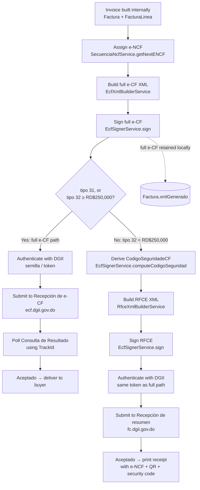

# e-CF Generation Flow

How Vyrko generates a DGII electronic invoice (e-CF), per DGII's requirements, and which parts of this are built today vs. planned. Status legend: ✅ built and verified · 🔜 planned (Phase 3, not yet built).

See `~/.claude/plans/check-grpahify-nodes-everything-snoopy-quasar.md` for the full multi-phase implementation plan this flow is drawn from, and `docs/XML_SIGNING_STUDY_GUIDE.md` for the concepts referenced below (canonicalization, XML-DSig, etc.).

---

## Overview

---

## Step by step

### 1. Build the invoice internally

Vyrko assembles `Factura` + `FacturaLinea[]` as normal — client, line items, quantities, prices, discounts. Nothing DGII-specific yet. **✅ Existing app functionality**, unrelated to e-CF.

### 2. Assign the e-NCF

`SecuenciaNcfService.getNextENCF(tipoECF)` atomically claims the next number from a DGII-authorized sequence range and returns `{ eNCF, fechaVencimientoSecuencia }`. **Purely local — no network call.** This burns a real, non-reusable number from the authorized range, so it should only run once you're actually committing to generate this document (not for previews).

Format: `E` + 2-digit tipo + 10-digit zero-padded sequence (13 chars total), e.g. `E320000000001`.

**Status: ✅ built** (`backend/src/secuencia-ncf/secuencia-ncf.service.ts`).

### 3. Build the full `<ECF>` XML

`EcfXmlBuilderService.build(factura, empresa, eNCF, fechaVencimientoSecuencia)` constructs the complete e-CF document — `Encabezado` (`IdDoc`/`Emisor`/`Comprador`/`Totales`), `DetallesItems` (every line), `FechaHoraFirma` — in the exact element order DGII's XSD requires. Pure function, no side effects, no DB writes.

Validates before building: `tipoECF` is 31 or 32; tipo-31 has a `fechaVencimientoSecuencia`; tipo-31 has a valid buyer RNC/cédula; every line has an `indicadorFacturacion` assigned (won't guess a tax classification — see plan file for why).

**This step always runs, for every tipo-32 invoice, even ones that will go the RFCE route (step 5b) — DGII requires the full document be retained locally even when only a summary is transmitted.**

**Status: ✅ built and verified** against the real `e-cf/xsd/e-CF 31 v.1.0 (1).xsd` / `e-CF 32 v.1.0.xsd` (`backend/src/facturacion-electronica/ecf-xml-builder.service.ts`).

### 4. Sign the full e-CF

`EcfSignerService.sign(xml)` applies the XML-DSig signature — SHA-256, RSA-SHA256, plain C14N, enveloped, certificate embedded — per DGII's spec. Produces the "e-CF tentativo": a complete, signed, ready-to-submit-or-retain document.

**Every e-CF gets signed here, before the path splits** — this matters because the RFCE path (step 5b) needs this signature to already exist in order to derive `CodigoSeguridadeCF`.

**Status: ✅ built and verified** (cryptographic round-trip confirmed, `backend/src/facturacion-electronica/ecf-signer.service.ts`).

### 5. The path splits: full e-CF vs. RFCE

Decision: **tipo 31, or tipo 32 with `MontoTotal ≥ RD$250,000`** → full e-CF path (5a). **Tipo 32 with `MontoTotal < RD$250,000`** (the common walk-in-consumer case for a repair shop) → RFCE path (5b).

#### 5a. Full e-CF path

1. **🔜 Authenticate** with DGII if no valid cached token: `GET .../autenticacion/semilla` → sign the returned seed (same `EcfSignerService.sign()`) → `POST .../autenticacion/validarsemilla` → Bearer token (~1h validity).
2. **🔜 Submit** the already-signed XML from step 4 to `POST .../recepcion/api/facturaselectronicas`. DGII responds immediately with just a `TrackId` — a receipt, not a verdict.
3. **🔜 Poll** `GET .../consultaresultado` with that `TrackId` until it resolves: `Aceptado` / `Rechazado` / `En Proceso` / `Aceptado Condicional`.
4. **🔜 Once accepted**, the document has fiscal validity — deliver it (or its printed representation) to the buyer.

#### 5b. RFCE path

1. **🔜 Derive `CodigoSeguridadeCF`**: `EcfSignerService.computeCodigoSeguridad(signedFullEcfXml)` — first 6 hex chars of SHA-256(the full e-CF's `SignatureValue`). Runs against the step-4 output, not the RFCE itself.
2. **✅ Build** the lighter `<RFCE>` XML: `RfceXmlBuilderService.build(factura, empresa, eNCF, codigoSeguridad)` — `Encabezado`/`Emisor`(minimal)/`Comprador`/`Totales` + that code. No line items — those stay only in the locally-retained full e-CF.
3. **✅ Sign** the RFCE — a second, independent signature from the full e-CF's, same `EcfSignerService.sign()`.
4. **🔜 Authenticate** with DGII (same mechanism as 5a.1 — one token, shared across both paths).
5. **🔜 Submit** to `POST https://fc.dgii.gov.do/.../recepcionfc/api/recepcion/ecf` — note the **different host** (`fc.dgii.gov.do`, not `ecf.dgii.gov.do`).
6. **🔜 Response** carries an estado (`Aceptado`/`Aceptado Condicional`/`Rechazado`) and whether the e-NCF sequence number can be reused if rejected.
7. **🔜 Print the receipt**: e-NCF, the security code, and a QR built from RNC emisor + e-NCF + monto total + that same code, scannable via `Consulta timbre FC`.

### 6. Persist the result

**🔜** Whichever path was taken, the outcome gets written back onto `Factura`: `eNCF`, `xmlGenerado` (the full signed e-CF — always, regardless of path), `codigoSeguridad` (RFCE path only), `fechaFirma`, `estadoDgii`, `trackId`, `mensajesDgii`. These columns are deliberately not in the schema yet — they get added in the same change that writes to them (Phase 3), not speculatively ahead of time.

### 7. Ongoing / exception paths (later phases)

- **🔜 Void unused e-NCF ranges** via `Anulación de e-NCF` when needed (Phase 3).
- **🔜 Receive e-CF/Aprobación Comercial from counterparties** — Vyrko must also act as a "Receptor Electrónico," not just an emisor (Phase 4).
- **🔜 Contingency mode** — if DGII or Vyrko's own connectivity is down, generate and sign locally anyway, submit within the 72-hour window once restored (Phase 5).

---

## Key files

| File | Role |
|---|---|
| `backend/src/secuencia-ncf/secuencia-ncf.service.ts` | e-NCF assignment (step 2) |
| `backend/src/facturacion-electronica/ecf-xml-builder.service.ts` | Full e-CF XML construction (step 3) |
| `backend/src/facturacion-electronica/rfce-xml-builder.service.ts` | RFCE XML construction (step 5b.2) |
| `backend/src/facturacion-electronica/ecf-signer.service.ts` | Signing + `CodigoSeguridadeCF` derivation (steps 4, 5b.1) |
| `backend/src/facturacion-electronica/ecf-xml.util.ts` | Shared tax-bucket aggregation/formatting used by both builders |
| `backend/src/common/catalogos/provincia-municipio.catalogo.ts` | DGII's location-code catalog, used by the `Emisor` block |
| *(Phase 3, not yet created)* `DgiiAuthService`, `EcfSubmissionService` | Steps 5a.1–5a.4, 5b.4–5b.7, 6 |
